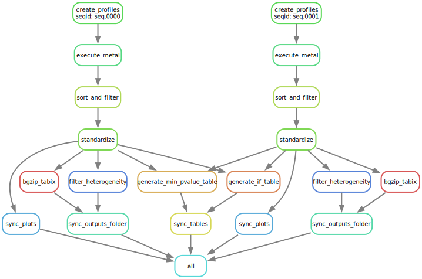

# meta_pipeline
In the field of pQTL (protein quantitative trait loci) analysis, meta-analysis plays a crucial role in synthesizing findings from multiple studies investigating the genetic regulation of protein levels.

This pipeline harmonises GWAS data from two different studies and runs [METAL](https://genome.sph.umich.edu/wiki/METAL) on them to identify common genetic variants that consistently affect protein levels.

## Requirements
* Singularity

For detailed requirements, refer to [environment.yml](environment.yml) and [Makefile](Makefile).

## Getting Started

To begin using the meta_pipeline, follow these steps:

1. Clone the repository with submodules:
   ```
   git clone --recurse-submodules https://github.com/ht-diva/meta_pipeline.git
   cd meta_pipeline
   ```

2. Customize the following files to match your environment:
   - [submit.sbatch](submit.sbatch)
   - [config/config.yaml](config/config.yaml)

3. Submit the job to the SLURM HPC using the following command:
   ```
   sbatch submit.sbatch
   ```

The pipeline generates output to the path specified by the **workspace_path** variable in the config.yaml file. By default, this path is set to `./results`. The final results are then copied to the destination path defined by the **dest_path** variable in the config.yaml file, with the default path being `./destination`.

The pipeline utilizes 2 path_list files to access the path to the study summary statistics, which can be found in the [data](data) directory.

Initially, the pipeline attempts to match each protein label from the first study with its corresponding label from the second study. It generates a **mismatch_table.csv** file in the workspace. Only matching datasets are processed with METAL.

Any files listed in the path_list but not found in the filesystem will be recorded in the **missing_files.csv** file.

## An example workflow


